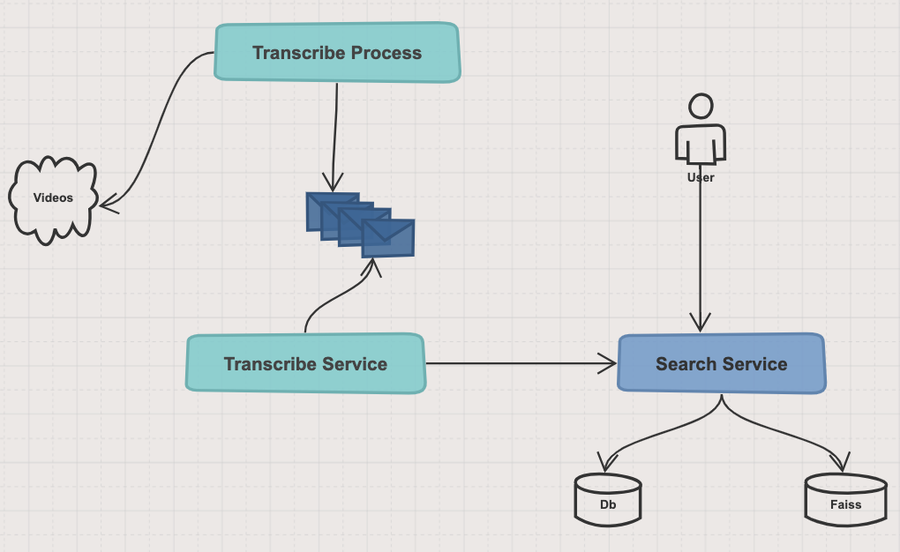

# Vidoso

## Overview
The high level goal of the system is to take a series of video files, transcribe it using open source models and make the transcript searchable using embedding based search.

### Running the app
- Clone the repo `git clone git@github.com:walterbrunetti/vidoso.git`
- `cd vidoso && docker-compose build && docker-compose up` - NOTE this might take several minutes on the first run.
- Open a browser tab and type `http://localhost:5000/`
- Optional: place MP4 videos under `videos` folder, in addition to those already there. 
- In a new tab in the Terminal, trigger the process to capture and index transcripts: 
  `docker exec -ti transcribe_service sh -c 'python3 transcribe_service/trigger_transcribe_process.py'`
- Once processing videos is complete, go back to the home page for a new search.

### Architecture

There are 2 services running:
- **Transcribe Service**: this service will add each video in a queue and run it through some tasks. 
  These tasks will generate the transcript and send it over the Search Service.
- **Search Service**: this service will store video transcriptions into a DB and index them under FAISS.
  It also provides APIs to allow users search for sentences in transcriptions.

#### Transcribe Service
- [Trigger transcribe process](https://github.com/walterbrunetti/vidoso/blob/main/transcribe_service/trigger_transcribe_process.py):
  - It will hit Search Service in order to get video names that have not been processed yet.
  - Produce a message into the queue for each video.

- [Consumers](https://github.com/walterbrunetti/vidoso/blob/main/transcribe_service/consumers.py#L46)
  - Each video will go through different tasks.
  - Last task will hit Search service with the video transcript.

#### Search Service
- The [Flask app](https://github.com/walterbrunetti/vidoso/blob/main/search_service/main.py#L12) will handle all the APIs requests.
- It's the only service with access to the DB.
- It knows how to get the data and [index it](https://github.com/walterbrunetti/vidoso/blob/main/search_service/faiss_index.py#L11) into FAISS.

### Libraries
- [FAISS](https://github.com/facebookresearch/faiss/wiki/Getting-started)
- [SentenceTransformers](https://www.sbert.net/)
- [SpeechRecognition](https://pypi.org/project/SpeechRecognition/)
- [deepmultilingualpunctuation](https://pypi.org/project/deepmultilingualpunctuation/)
- [Flask](https://flask.palletsprojects.com/en/3.0.x/)
- [Celery](https://docs.celeryq.dev/en/stable/getting-started/introduction.html)

### Troubleshooting & Limitations

**Google Speech API limit**

The SpeechRecognition library acts as a wrapper for several popular speech APIs and is thus extremely flexible. 
One of these is Google Web Speech API.

There is a rate limit from Google of about ~50 requests per day. Should be good enough for testing this app, but be warned if you see this error.

The solution is waiting until getting the new quota. Videos in the queue that were successfully transcript will not be affected.

**Conflicts with docker URLs or ports being used**

Based on your OS, your DOCKER_HOST is different. If docker have problems finding or exposing URLs or PORTs,
feel free to update them in the following files:
- https://github.com/walterbrunetti/vidoso/blob/main/transcribe_service/celery_app.py#L12
- https://github.com/walterbrunetti/vidoso/blob/main/transcribe_service/trigger_transcribe_process.py#L11
- https://github.com/walterbrunetti/vidoso/blob/main/docker-compose.yml#L33

This app was tested under Mac.

**Triggering transcribe job not completing successfully**

Even when the process could fail for some video, the rest of the videos in the queue should be completed successfully.

When the process finishes, will trigger a task that will tell the Search Service to update the index.
This task will run even when some tasks failed for any video.

If still you see index is not being updated, restart the app:
`docker-compose stop && docker-compose up`.

Restarting the app will force an index update.

